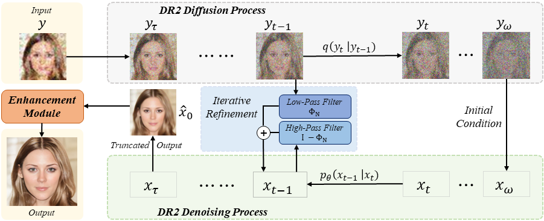
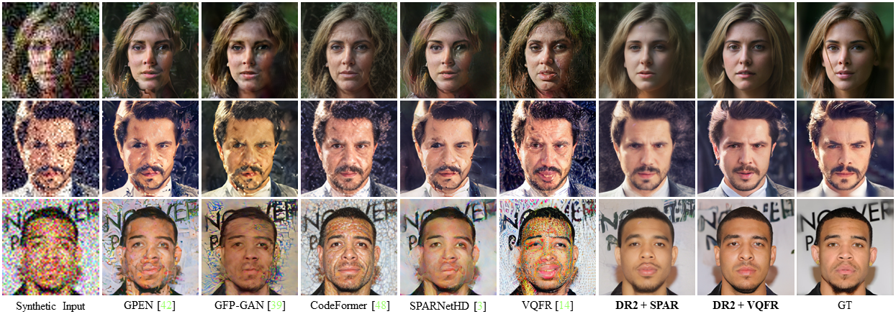

# DR2 + Enhancement

This is the implementation [DR2: Diffusion-based Robust Degradation Remover for Blind face Restoration](https://arxiv.org/abs/2303.06885) (CVPR 2023).

## Overview

DR2E is a two-stage blind face restoration framework consists of the degradation remover DR2 and an enhance module which can be any existing blind face restoration model. In the first stage, DR2 utilizes the input image to control the diffusion sampling process and results in smooth, clean middle result in $\hat{x}_0$ . In the second stage, the enhancement modules maps $\hat{x}_0$ in to high-res and high-quality output.



## Download pre-trained models

#### DR2

Our implementation of DR2 module is heavily based on [ILVR_adm](https://github.com/jychoi118/ilvr_adm), and the pretrained model is trained on FFHQ dataset to generate $256 \times 256$ face images. You can download DR2 model we use for our paper from [Baidu Cloud Drive](https://pan.baidu.com/s/1g8cz0hbd3wByfP9Q9bSHCQ?pwd=dr2e)  , or try more pretrained weights at [P2-weighting](https://github.com/jychoi118/P2-weighting).

#### Enhancement Module

Variant blind face restoration models can be plugged in as the enhancement module. To use these model, you can 

##### 1. Training from Scratch

In our implementation, we choose [SPARNetHD](https://github.com/chaofengc/Face-SPARNet) and train it from scratch. The training code and loss functions remain unchanged to the original paper, but we construct training set using DR2 augmentation (which is introduced in the paper section 3.4) as follows:
$$
y = DR2(x) \circledast k_\sigma
$$
where $x$ is the ground truth high-quality image, and $y$ is the input image. This helps the enhancement module adapts faster to DR2 output. Other than this, no more degradation model is required. You can download SPARNetHD weights from [Baidu Cloud Drive](https://pan.baidu.com/s/1g8cz0hbd3wByfP9Q9bSHCQ?pwd=dr2e).

##### 2. Use Pretrained Models

You can directly use pretrained blind face restoration methods like [VQFR](https://github.com/TencentARC/VQFR), [CodeFormer](https://github.com/sczhou/CodeFormer), [GPEN](https://github.com/yangxy/GPEN) without further finetuning. Because these methods are trained on complex degradation model and can work fine on DR2 output. 

## Quick Start

First clone the repo and install dependent packages 

```
# build dependency
pip install -r requirements.txt
```

Download pretrained weights for DR2 and SPARNetHD and put them in "./weights". And run demo 

```
python demo.py
```

This will enhance the testing images is file "./test_images/input". Noting that for each subdirectory, we choose different controlling parameters $(N, \tau)$ (please refer to out paper). Feel free to change the controlling parameters and see how they affect the output. Noting $N \in \{1, 2, 4, 8, 16, ...\}$ and $\tau \in \{0,1,2,3,..,T\}$. Since we inference every 10 steps for speed by default, $T$ should be 100 rather than 1000.

```
# in demo.py, line 11-16
dir_para = [    
    # [data_dir, (N, \tau)]
    ["./test_images/input/01/", (4, 22)],
    ["./test_images/input/02/", (8, 35)],
    ["./test_images/input/03/", (16, 35)],
] 
```

The results of two stages are stored in "./test_images/output". If you installed other blind face restoration methods, you can run them on "./test_images/output/dr2" file.

## Results

This the results reported in out paper and you can see our method is robust against heavy degradation and  our framework enable VQFR to perform normally again. 



Because the stochastic nature of diffusion sampling process, you may get different results on a single images (unless you're using very small $N$ and $\tau$). But we found it wouldn't affect the average quantitative score (like PSNR, SSIM, FID, LPIPS)  if tested on a big testing set containing hundreds or thousands of images. 

## Contact

If you have any questions, please contact dedsec_z@sjtu.edu.cn.
